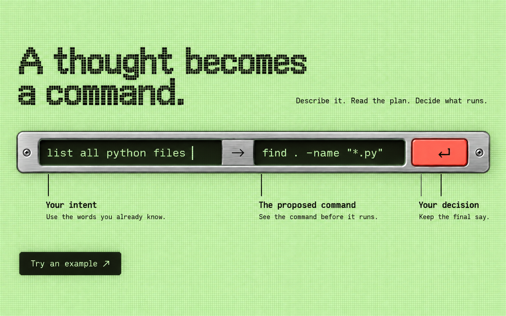
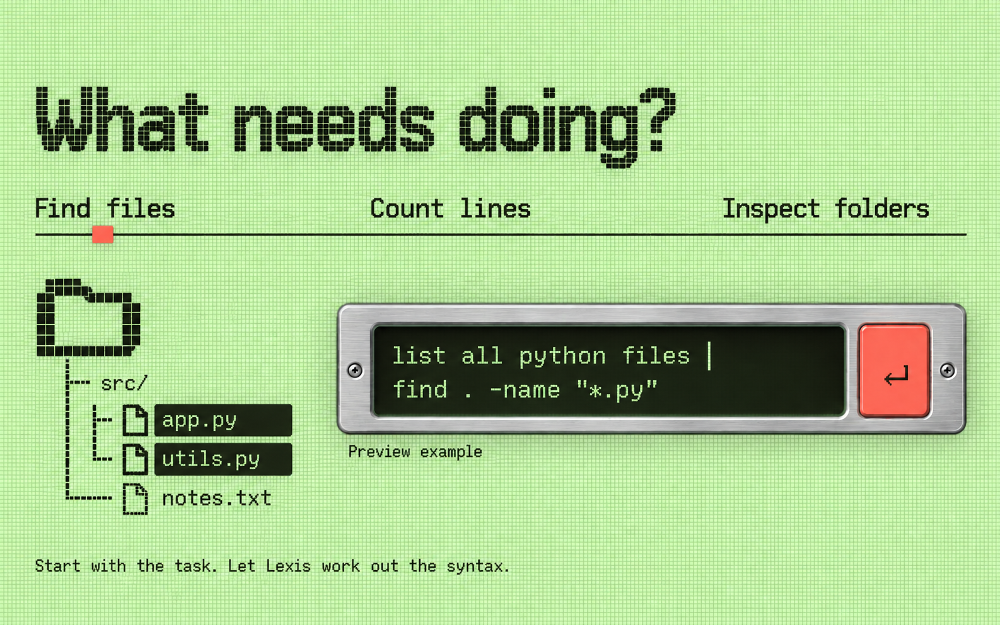
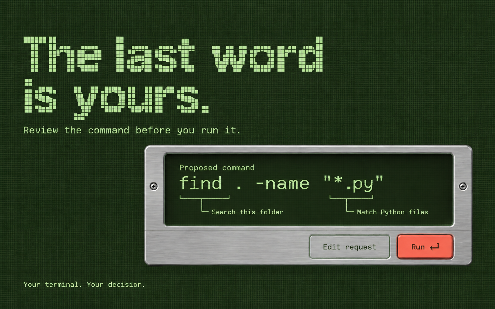
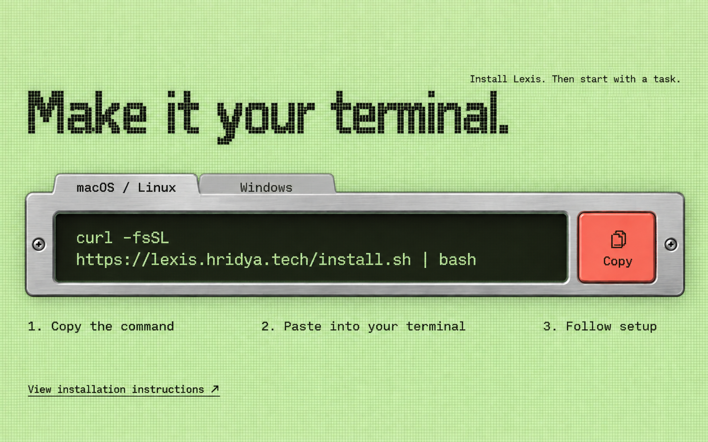
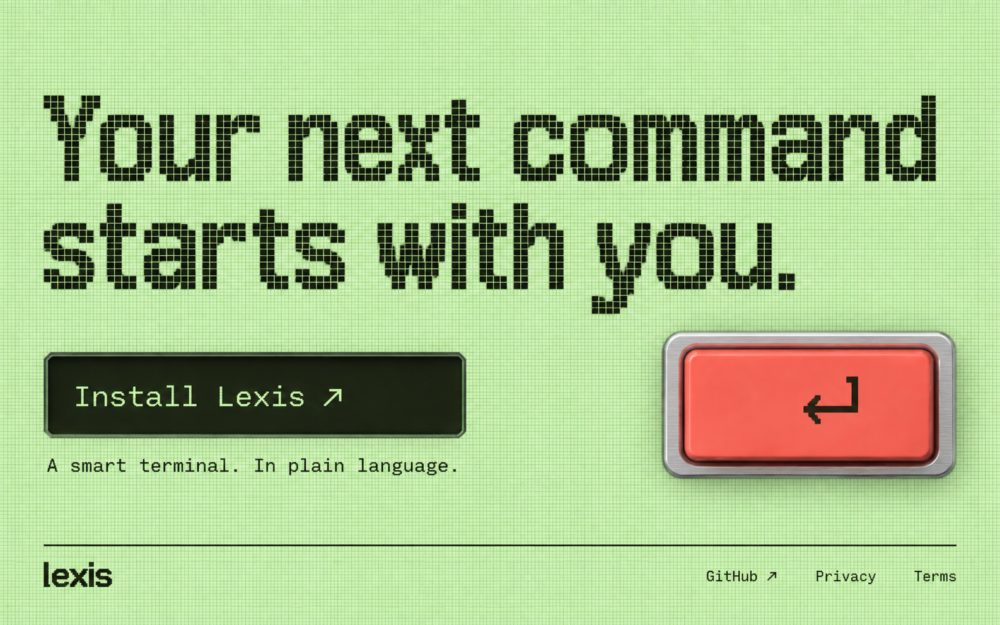

# Lower-section concepts

Generated with the built-in image generation tool on 2026-09-19, using ../reference.png as the visual reference. These are proposed additions; the approved hero specification remains unchanged.

Five separate 16:10 section images continue the LCD design. In implementation, installation commands must remain a single logical line when copied. The review section illustrates the CLI; a website demo must explicitly simulate execution.

## Section 2 of 6 — From thought to command

Art-direction prompt:

Create a thoughtful process section on the SAME pale-green matrix. Top-left medium-large square-pixel headline "A thought becomes\na command." with right-aligned small mono copy "Describe it. Read the plan. Decide what runs." The visual is a broad precision-machined horizontal conveyor-like control strip across the middle, physically shallow and fully FRONT-ON, not tilted. Within it a continuous black-green screen presents three stages with different widths: a wide natural language input "list all python files"; a narrow engraved metal transition bridge with a rightward arrow; an equally wide output 'find . -name "*.py"'. A SINGLE coral square return key on the far right makes the final step tactile. This is one continuous instrument, not three equal cards. Under the screen, thin aligned leader lines connect the input to label "Your intent", the output to "The proposed command", the key to "Your decision". Each label has a short sentence in clear mono, not tiny copy. The left sentence "Use the words you already know." The middle "See the command before it runs." The last "Keep the final say." A quiet inline link at bottom-left "Try an example ↗". Asymmetric spacing, exact material bevels, lots of green breathing space. Clever transformation metaphor is structural, not decorative.

## Section 3 of 6 — The example selector

Art-direction prompt:

Create a distinctive interactive examples section. Pale celery LCD canvas. Top-left square-pixel heading "What needs doing?" at moderately large scale. Beneath, an OPEN horizontal example chooser spans whole width: three text labels "Find files" "Count lines" "Inspect folders" separated by plenty of whitespace, with a thin dark baseline and one CORAL small square marker under selected "Find files". Not pill tabs. Lower-left one oversized dark pixel folder icon assembled from the same square cells as reference heading, with a precise branching file tree beneath: "src/" then "app.py" "utils.py" "notes.txt", the two .py rows visibly selected in dark olive. Folder/tree diagram occupies left 35% as meaningful product illustration. On right 55%, a wide shallow metal terminal inset aligned with the selected tree has visible request "list all python files" then proposed command 'find . -name "*.py"' on its dark green screen. A clear small label under screen "Preview example" and a single coral return key at right. Screen metal is thin, don't make a giant computer chassis. Bottom of section short supporting line "Start with the task. Let Lexis work out the syntax." Flat web UI and pixel-based file visual, no photoreal props. The motif of selected file extensions transfers natural language to actual terminal intent. Balanced large negative spaces, unusual but perfectly clear.

## Section 4 of 6 — Review before running

Art-direction prompt:

Create a section that shifts into the DARK LCD mode of the exact reference world: deep olive-green matrix ground, pale celery square-pixel heading, same shallow silver metal and coral accent. No black/amber CRT aesthetics. Place medium-large headline "The last word\nis yours." in upper-left with small support beneath "Review the command before you run it." Center-right and lower half feature ONE broad realistic thin brushed-metal command-review plate, straight-on, offset to the right, deliberately overlapping the space beneath the heading without covering copy. Inside dark green plate use a sparse readable command anatomy: small label "Proposed command", large mono 'find . -name "*.py"'. Underneath, two thin pale-green leader lines from "find ." and '"*.py"' terminate in simple explanatory labels "Search this folder" and "Match Python files". These are accurate explanations, not fake security badges. The bottom edge of the plate has a restrained outlined "Edit request" action and one coral physical "Run ↵" key. Outside plate bottom-left: "Your terminal. Your decision." in small pixel mono. Make the composition like an industrial instrument's carefully labeled inspection window, with superb spacing and tactile precision. Not a dashboard, not a warning-filled security panel. Silver only 12% of image. Dark green negative space feels calm and controlled.

## Section 5 of 6 — Installation console

Art-direction prompt:

Create the installation section on the pale-green LCD matrix from reference. Heading medium-large dark square pixels at top-left "Make it your terminal." Small support at upper-right "Install Lexis. Then start with a task." Layout is a beautifully designed front-on shallow brushed-metal installation drawer occupying central 75% width, broad and squat, with generous green around it. Top edge of drawer contains two native-looking engraved flat tabs "macOS / Linux" selected and "Windows" inactive. No OS logos. Large dark olive screen in the drawer holds exact readable command on TWO deliberately wrapped lines: "curl -fsSL" then "https://lexis.hridya.tech/install.sh | bash". On right a coral rectangular physical button with small copy icon and the label "Copy". The hardware is an interface metaphor, still a functioning website composition, no desk, no monitor, no large thick chassis. Under the drawer, OPEN plain-text instructions in an asymmetric row: left "1. Copy the command" center "2. Paste into your terminal" right "3. Follow setup". Keep text generously spaced and readable, no boxes. Bottom-left understated link "View installation instructions ↗". Exact shell spelling matters. The drawer has fine horizontal grain, two small screw heads, precise inset edge, similar to approved hero rail but taller for two lines. An excellent ergonomic setup screen with an inventive physical tab treatment, not generic download cards.

## Section 6 of 6 — Closing and footer

Art-direction prompt:

Create an elegant closing CTA and footer section of the same Lexis website. Same pale celery LCD matrix, dark olive square-pixel typography. This is the quiet concluding composition: giant but spacious left-aligned pixel headline "Your next command\nstarts with you." occupies upper half, precise line breaks and ample right margin. Below heading, centered on its left edge at 56px, one dark olive rectangular CTA "Install Lexis ↗", with pale-green pixel text and subtle inset LCD depth as in approved hero. To the RIGHT of the CTA region, one enormously enlarged coral return key, FRONT-ON, precisely rounded rectangular physical cap, restrained brushed aluminum thin base, engraved dark return arrow, occupies only about 22% of width and grounds the close. Do not put headline text on button or float extra keycaps. Small line under CTA "A smart terminal. In plain language." Then substantial breathing room. Along bottom a single fine dark olive horizontal rule and compact footer: lowercase heavy-sans "lexis" at left, links "GitHub ↗" "Privacy" "Terms" aligned at right. No newsletter signup, fake availability indicator, social icons or copyright date. The oversize return key is an unmistakable final punctuation mark, with beautiful bevel and tightly controlled soft shadow. Understated, highly crafted and coherent with approved reference. Not a repeated hero input form.

